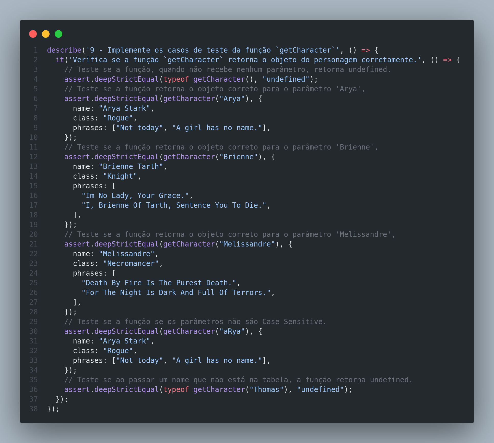
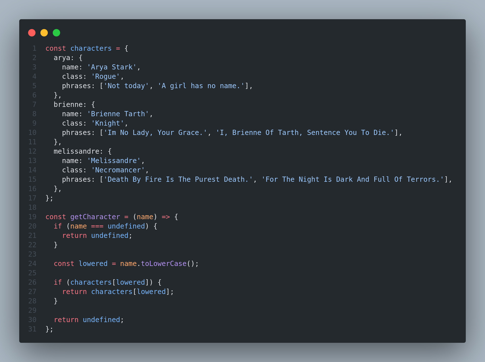

# Trybe Project JS Unit Tests 27/07/2021
 

  

 

## Habilidades

- Escrever testes unitários para funções utilizando o módulo Assert do NodeJS para verificar o correto funcionamento dessas funções;
- A partir de testes já implementados, escrever funções de forma que elas atendam aos testes propostos;
- Escrever testes e funções utilizando uma abordagem de desenvolvimento orientado a testes.

## Desenvolvimento
Funções para atender aos requisitos propostos e/ou testes unitários para garantir que as implementações das funções estão corretas. Exemplo:

 

  
  

## Resultados

- `1` dia de projeto;
- `10` requisitos;
- Percentual de cumprimento de requisitos obrigatórios `90.00%`;
- Percentual de cumprimento de requisitos totais `90.00`.
